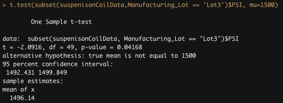

# MechaCar Statistical Analysis

## Linear Regression to Predict MPG

<strong>Which Variables/Coefficients provided non-random amount of variance to the mpg values in the dataset?</strong>
- We had 2 variables with p-values that were smaller than our assumed significance level of 0.05. Those variables were `vehicle_length` and `spoiler_angle` which provided non-random amounts of variance to the mpg values.

<strong>Is the slope of the linear model considered to be zero? Why or why not?</strong>
- The slope of the linear model is not zero (we rejected our null hypothesis of the slope of the linear model is zero), because the p-value of our linear regression analysis was 5.35e-11 which is magnitudes below our significance level of 0.05.

<strong>Does the linear model predict mpg of MechaCar prototypes effectively? Why or Why not?</strong>
- One could could argue that because our model has an r-squared value of approximately 0.71 that this is a good model. However, I do not think it wiil predict mpg of future prototypes effectively because of overfitting. Only 2 of the 5 variables had a significant contribution to the linear model with the current data. The remaining 3 variables might affect the accuracy of future predicted data.

## Summary Statistics on Suspension Coils

<strong>The design specifications for the MechaCar suspension coils dictate that the variance of the suspension coils must not exceed 100 pounds per square inch. Does the current manufacturing data meet this design specification for all manufacturing lots in total? Why or why not?</strong>
- As you can see from the total summary of all the lots below, the manufacturing data meets the design specification because the variance is 63 which is less than the allowed variance of 100 PSI. 

<strong>Does the current manufacturing data meet this design specification for each lot individually? Why or why not?</strong>
- As you can see from the lot summaries below, the manufacturing data for Lot 1 and Lot 2 meet the design specification. However, Lot 3 does not meet the design specification because the variance for Lot 3 is 170 which is more than the allowed variance of 100 PSI. 

## T-Tests on Suspension Coils

### All Lots

- From the results shown below, we see that our t-test returned a p-value equal to 0.06028. Assuming a signficance level of 0.05, our p-value is above the threshold, and therefore, we do not have sufficient evidence to reject the null hypothesis. This indicates there is no statistical difference between all the lots' mean and the population mean.

### Lot 1
- From the results shown below, we see that our t-test returned a p-value equal to 1. Assuming a signficance level of 0.05, our p-value is above the threshold, and therefore, we do not have sufficient evidence to reject the null hypothesis. This indicates there is no statistical difference between this sample and the population.

### Lot 2
- From the results shown below, we see that our t-test returned a p-value equal to 0.6072. Assuming a signficance level of 0.05, our p-value is above the threshold, and therefore, we do not have sufficient evidence to reject the null hypothesis. This indicates there is no statistical difference between this sample and the population.

### Lot 3
- From the results shown below, we see that our t-test returned a p-value equal to 0.04168. Assuming a signficance level of 0.05, our p-value <i>is</i> below the threshold, and therefore, we <i>do</i> have sufficient evidence to reject the null hypothesis. This indicates there <i>is</i> a statistical difference between this sample's mean and the population mean.

## Study Design: MechaCar vs Competition

<strong>Write a short description of a statistical study that can quantify how the MechaCar performs against the competition.</strong>

With the naming of the prototype being MechaCar, it sounds like this car is targeting the muscle car/souped-up car demographic. That would lead us to focus our study on cost per horse power, cost per cylinders, and city mpg. If we can show that the MechaCar is statistically different in these metrics than its competition, then we can argue that the MechaCar is the better car.

In summary:
- <strong>What metric or metrics are you going to test?</strong> 
  - Cost per horse power, cost per cylinders, and city mpg.
- <strong>What is the null hypothesis or alternative hypothesis?</strong>
  - Our null hypothesis is that ther is no statistical difference between the MechaCar's mean and the competitor's mean in each metric.
- <strong>What statistical test would you use to test the hypothesis? And why?</strong>
  - For each metric, we would use a two-sample t-Test because it compares two samples to determine if their means are statistically different.
- <strong>What data is needed to run the statistical test?</strong>
  - We would need our competition's data for horse power, cylinders, city mpg, and cost. Most of that data we could get online. Ideally, we could survey current car owners to get a more variable and actual city mpg.